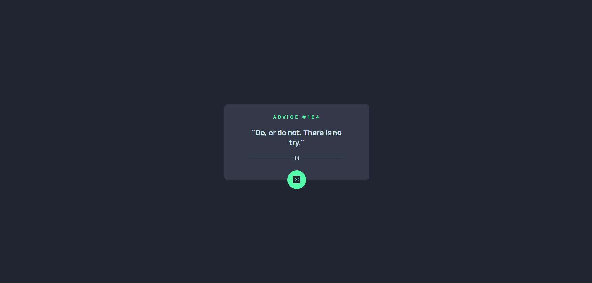

# Advace generator

# Propósito da aplicação:
- O propósito da aplicação é trabalhar com dados assincronos usando o ASYNC e AWAIT e a manipulaçao da DOM dentro do javascript.

# Funcionalidades:
- A aplicação faz a requisição de uma API que traz um frase aleatória a cada requisição e mostra em tela e um botão que ao clicar executa novamente a função fazendo uma nova requisição.

# Ferramentas utilizadas:

# 
- HTML5: Foi utilizado HTML5 para a criação da estrutura web da aplicação.

# 
- CSS3: Foi utilizado CSS3 para a estilização da aplicação.

# 
- JavaScript: Foi utilizado a linguagem JAVASCRIPT para fazer a requisição da API e a manipulação da DOM da aplicação.

## Licensa

[MIT](https://choosealicense.com/licenses/mit/)
    
